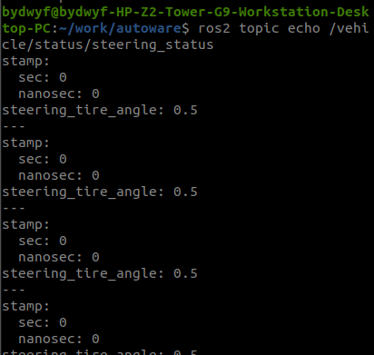

# Ros2进行node建立、消息发布与订阅

> ref：https://github.com/jmtc7/autoware-course/tree/master/02_ROS2_101

## Ros2

##### 启动Autoware

```shell
source ~/work/autoware/install/setup.bash

#使用主机启动，不使用仿真器
ros2 launch autoware_launch autoware.launch.xml map_path:=$HOME/autoware_map/sample-map-planning vehicle_model:=sample_vehicle sensor_model:=sample_sensor_kit
```

相关node:

```
/system/topic_state_monitor_vehicle_status_steering_status
```

相关topic

```
/vehicle/status/steering_status
```

使用主机启动时，是没有publisher给topic发消息的


这时，如果用另一个终端对该主题进行消息发布：

```shell
ros2 topic pub --rate 1 /vehicle/status/steering_status autoware_auto_vehicle_msgs/msg/SteeringReport "{steering_tire_angle: 0.5}"
```




可以接收到消息，因此下一步是创建一个node去实现当我启动了autoware之后就能够对该topic发送消息

创建package

```shell
cd /work/autoware/src/universe/

ros2 pkg create --build-type ament_python my_steer
```


在 `/my_steer/my_steer/`路径下创建`steering_status_publisher.py`

```python
import rclpy
from rclpy.node import Node
from autoware_auto_vehicle_msgs.msg import SteeringReport  # 导入消息类型
from builtin_interfaces.msg import Time
from rclpy.time import Time as ROS2Time

class SteeringStatusPublisher(Node):
    def __init__(self):
        super().__init__('steering_status_publisher')
        self.publisher_ = self.create_publisher(SteeringReport, '/vehicle/status/steering_status', 10)
        self.timer = self.create_timer(1.0, self.publish_message)
        self.get_logger().info('Steering Status Publisher has been started.')

    def publish_message(self):
        # 获取当前时间
        now = self.get_clock().now()
        
        # 创建消息
        msg = SteeringReport()
        msg.stamp = self.get_clock().now().to_msg()
        msg.steering_tire_angle = 0.5  # 示例值
        
        # # 创建时间戳消息
        # time_msg = Time()
        # time_msg.sec = now.seconds
        # time_msg.nanosec = now.nanoseconds % 1_000_000_000
        
        # 将时间戳添加到消息
        # 假设我们可以在 SteeringReport 中添加时间戳字段
        # msg.timestamp = time_msg  # 如果消息定义中有时间戳字段

        # 发布消息
        self.publisher_.publish(msg)
        self.get_logger().info(f'Publishing: steering_angle={msg.steering_tire_angle}')

def main(args=None):
    rclpy.init(args=args)
    node = SteeringStatusPublisher()
    rclpy.spin(node)
    node.destroy_node()
    rclpy.shutdown()

if __name__ == '__main__':
    main()
```

更新`setup.py`

用到了`autoware_auto_vehicle_msgs`因此，在`package.xml`中添加包


在`/my_steer`路径下创建launch文件夹，创建steering_status_launch.xml文件


```xml
<launch>
  <node pkg="my_steer" type="steering_status_publisher" name="steering_status_publisher" output="screen"/>
</launch>
```

进入`/autoware/src/launcher/autoware_launch/autoware_launch/launch`目录下，打开autoware.launch.xml


在末尾添加自定义包

```xml
<include file="$(find-pkg-share my_steer)/launch/steering_status_launch.xml"/>
```

重新进入主目录 `/work/autoware`

```shell
colcon build --packages-select my_steer

source ~/work/autoware/install/setup.bash

#使用主机启动，不使用仿真器
ros2 launch autoware_launch autoware.launch.xml map_path:=$HOME/autoware_map/sample-map-planning vehicle_model:=sample_vehicle sensor_model:=sample_sensor_kit
```

此时发现方向盘转角并未变化


且自定义节点并未启动

打开另一个终端

```shell
source ~/work/autoware/install/setup.bash

ros2 run my_steer steering_status_publisher
```

这时，就有了publisher


打开rqt_graph可以看到已经实现了


此时打开autoware的rviz界面，可以看到方向盘转角已经有了变化

0.5是弧度值，转为角度为28.6度


解决了为什么在autoware.launch.xml中配置后仍然无法跟随Autoware启动的问题：

将`/my_steer`路径下创建launch文件夹，创建的steering_status_launch.launch.xml文件改为

```shell
<launch>
  <node pkg="my_steer" exec="steering_status_publisher" name="steering_status_publisher" output="screen"/>
</launch>
#原本的是 pkg="my_steer" type="steering_status_publisher" name="steering_status_publisher" output="screen"
#type 是ros1的写法，改为exec即可
```

并且，colcon build之后还需要在

```
/home/bydwyf/work/autoware/install/my_steer/share/my_steer
```

路径下创建launch文件夹，添加相同的steering_status_launch.launch.xml


这样子，就可以按照下列命令启动autoware，该节点也会跟随启动

```shell
source ~/work/autoware/install/setup.bash

#使用主机启动，不使用仿真器
ros2 launch autoware_launch autoware.launch.xml map_path:=$HOME/autoware_map/sample-map-planning vehicle_model:=sample_vehicle sensor_model:=sample_sensor_kit
```

